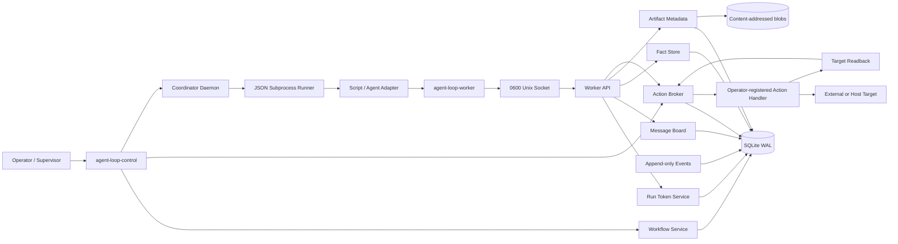

# Architecture

Agent Loop System is a local, runner-agnostic control plane for durable multi-agent work. The control plane owns coordination. Model CLIs and scripts are replaceable workers.

## Status

Implemented in `0.2.0`:

- SQLite/WAL system of record and append-only audit events
- missions and dependency-aware task graphs
- atomic claims, leases, heartbeats, retries, fencing, and resource locks
- typed message board with durable subscription cursors
- versioned, owner-scoped shared facts
- content-addressed artifacts with provenance and integrity checks
- action capabilities, risk policy, approvals, budgets, execution receipts, and readback verification
- strict JSON subprocess contract with process-group timeout and cancellation
- optional supervisor-owned verification command before completion
- one-run worker tokens and a capability-scoped Unix socket API
- operator and worker CLIs

Not implemented:

- distributed consensus or multi-host leadership
- a built-in model provider
- generic external side-effect handlers
- a browser dashboard
- exactly-once external effects

Those omissions are deliberate. The first release is a correct single-host control plane, not a fake distributed system.

## Invariants

1. The database, not a model transcript, is the source of truth.
2. Agents never receive direct database access.
3. Every task run has one worker identity, one lease, and one fencing run ID.
4. Delivery is at least once. Idempotency keys make redelivery safe.
5. Shared facts use compare-and-swap versions. Last-writer-wins is forbidden.
6. Large outputs become immutable artifacts; messages carry references.
7. A proposed action is not an executed action.
8. Approvals bind the exact canonical payload hash.
9. External outcomes are `unknown` when readback cannot prove success or failure.
10. Operators can pause new claims or cancel a mission and terminate active process groups.
11. Workers cannot write policy, approvals, receipts, or audit history.
12. Hermes, Codex, OpenCode, Claude Code, local models, and scripts are adapters—not control-plane dependencies.

## Component diagram



## Trust boundaries

### Operator zone

The operator controls:

- mission lifecycle
- task graph creation
- executable and workspace allowlists
- worker capability sets
- action capability grants
- risk classifications
- approvals and denials
- budget limits
- action-handler registration
- process supervision and shutdown

### Control-plane zone

The control process owns:

- SQLite database files
- artifact storage
- Unix socket
- plaintext run tokens while a run is active
- task claims and leases
- action receipts and audit records

Files are created with owner-only permissions where applicable. The production system unit runs the supervisor as `agent-loop-control`; canonical state is not traversable by `agent-loop-worker`. Worker containers must preserve the same exclusion.

### Worker zone

A worker receives:

- a task-specific request
- a one-run token
- the Unix socket path
- only the filesystem and network access granted by the launcher

The supplied launcher resolves the worker account before dispatch, wraps the already-allowlisted command with trusted `setpriv` arguments, clears supplementary groups and all capability sets, enables `no_new_privs`, and sets a parent-death signal. The child receives a constructed environment instead of inheriting supervisor secrets. Default task workspaces and the mode-`0600` control socket are chowned to the worker identity; canonical state remains owned by the control identity.

A worker does not receive:

- database credentials or paths
- another worker's token
- approval authority
- action-handler access
- audit-table write access
- policy-file write access

The Unix socket authenticates every method with the token hash and rechecks that the referenced run remains current and active.

## Durable data model

### Missions

A mission is the operator-visible unit of work.

States:

```text
draft → active ↔ paused
  │       │
  └───────┴──→ cancelled
```

- `draft`: graph preparation; no claims
- `active`: task creation and claims allowed
- `paused`: existing work may finish; no new claims
- `cancelled`: queued and running work invalidated

### Tasks

A task records:

- stable task and mission IDs
- assignee role
- JSON specification and acceptance contract
- parent dependencies
- exclusive resource keys
- priority and optional schedule
- attempt and runtime ceilings
- current run ID and lease owner
- completion summary and structured metadata
- monotonic row version

Typical states:

```text
blocked → ready → running → succeeded
                   │
                   ├→ retry_wait → ready
                   ├→ failed
                   └→ cancelled
```

Parents promote children only after all parent tasks succeed. Parent handoffs use structured completion data, never transcript scraping.

### Runs, leases, and fencing

Claiming a task occurs under `BEGIN IMMEDIATE`:

1. Find one eligible task for an admitted role.
2. Reject tasks whose resource keys have live leases.
3. Increment the attempt counter.
4. Create a unique run ID.
5. Mark the task `running` with lease owner and expiration.
6. Insert resource leases keyed by resource name.
7. Append a claim event.
8. Commit atomically.

Every heartbeat and terminal transition must present the current run ID and worker identity. A stale worker cannot complete work after lease recovery because the run ID acts as a fencing token.

### Messages

A message contains:

- global sequence and stable message ID
- mission and optional task scope
- topic
- typed kind
- authenticated actor ID
- optional recipients, correlation ID, reply ID, subject, JSON data, and artifact references
- optional mission-scoped dedupe key and expiration

Admitted message kinds:

- `fact_observation`
- `hypothesis`
- `question`
- `response`
- `request`
- `decision_proposal`
- `decision_notice`
- `checkpoint`
- `conflict`
- `hotspot`
- `review_note`
- `verdict`
- `alert`

Topics must start with `mission.<mission_id>`. Prefix matching treats `_` as a literal character, not a SQL wildcard.

### Subscriptions

Subscriptions persist:

- mission
- subscriber identity
- topic prefix
- last acknowledged sequence

Only the authenticated subscriber can read or acknowledge a worker subscription through the scoped API. Redelivery is intentional until acknowledgement.

### Shared facts

Facts use `(mission_id, fact_key)` as identity and store an owner plus integer version.

```text
create: expected_version = 0 → version 1
update: expected_version = N → version N + 1
```

A stale version raises a conflict. A peer cannot overwrite another owner's fact. Disagreement belongs in a `conflict` or `decision_proposal` message instead of a silent overwrite.

### Artifacts

Artifact bytes are stored by SHA-256 digest. Metadata records mission, task, actor, original filename, media type, digest, size, storage path, dedupe key, and creation time.

Readback rejects:

- missing blobs
- path escape
- symbolic links
- digest mismatch
- size mismatch
- cross-mission worker access
- cross-task completion evidence

### Actions

Action lifecycle:

```text
proposed
  ├→ authorized ─→ executing ─→ verified | unverified | failed | unknown
  ├→ awaiting_approval ─→ authorized | denied
  └→ denied
```

Risk policy is external to the model:

- `R0`: read-only or inert; no approval
- `R1`: bounded reversible local write; no approval
- `R2`: host or service change; approval required
- `R3`: external communication, publication, or spending; approval required
- `R4`: policy, audit, identity, persistence, or shutdown mutation; denied

A capability grant admits an exact action type. The worker API only exposes proposal creation. Approval and execution remain outside the worker surface.

A handler must implement:

```python
class ActionHandler(Protocol):
    def execute(self, request: ActionRequest) -> dict: ...
    def verify(self, request: ActionRequest, result: dict) -> dict: ...
```

`verify` reads the target after execution. Missing or ambiguous readback produces `unknown`; the broker does not retry an ambiguous effect.

### Budgets

Budgets are keyed by scope type, scope ID, and unit. Reservations are atomic and idempotent. Concurrent reservations cannot exceed the configured limit.

The coordinator automatically charges one configured mission-level `runs` unit before process start. Exhaustion fails the run without starting the worker. Provider adapters charge token, dollar, and external-request units around actual use.

Example units:

- tokens
- dollars
- actions
- runtime_seconds
- external_requests

## Worker protocol

The coordinator writes one JSON request to worker stdin:

```json
{
  "mission_id": "mis_example",
  "task_id": "tsk_example",
  "run_id": "run_example",
  "worker_id": "researcher-1",
  "goal": "Produce a cited report",
  "specification": {},
  "acceptance": {"minimum_artifacts": 1},
  "context": {"parent_handoffs": []},
  "workspace": "/srv/agent-workspaces/mis_example/tsk_example",
  "limits": {"max_runtime_seconds": 900},
  "control": {
    "socket_path": "/run/user/1000/agent-loop-researcher-1.sock",
    "token": "[ONE-RUN TOKEN]"
  }
}
```

The worker writes one JSON result to stdout:

```json
{
  "outcome": "candidate_complete",
  "summary": "Report produced and checked",
  "artifact_ids": ["art_example"],
  "evidence": [
    {"kind": "command", "value": "pytest -q", "exit_code": 0}
  ],
  "fact_proposals": [],
  "residual_risks": [],
  "requested_followups": []
}
```

`blocked` and `failed` are valid non-completion outcomes. Completion candidates are rejected when required evidence is missing or referenced artifacts fail integrity and scope checks.

On Linux, every worker and verifier invocation receives a fresh delegated cgroup. A trusted launcher joins that cgroup before worker code executes. The runner invokes `cgroup.kill` and removes the subtree after timeout, cancellation, normal completion, or verifier completion, so `setsid()`, double-fork, and daemonized descendants cannot survive the task. Production passes `--require-cgroup`; `/proc` descendant freezing is only a fallback.

Worker-authored evidence is a claim. For consequential work, the task acceptance contract should include `verification_command` and `verification_timeout_seconds`. The coordinator runs that command as a second bounded process under the same allowlist, workspace, runtime, and cancellation controls. The verifier receives no run token. A nonzero exit rejects completion; a zero exit becomes control-plane-authored verification metadata.

## Worker API

The socket protocol is newline-delimited JSON:

```json
{
  "token": "[ONE-RUN TOKEN]",
  "method": "message.publish",
  "params": {
    "topic": "mission.mis_example.general",
    "kind": "checkpoint",
    "body": "draft complete"
  }
}
```

Methods are capability-scoped:

- `context.get`
- `heartbeat`
- `message.publish`
- `message.list`
- `subscription.create`
- `subscription.read`
- `subscription.ack`
- `fact.get`
- `fact.put`
- `artifact.put`
- `artifact.read`
- `action.propose`

The convenience CLI is `agent-loop-worker`. No worker method can approve or execute an action.

## Failure and recovery

### Worker crash

The task remains running until the lease expires. The next coordinator pass:

1. closes the old run as expired
2. releases resource leases
3. returns the task to `ready` or marks the task failed after the attempt ceiling
4. issues a new run ID if reclaimed

Late completion from the old run is rejected.

### Coordinator crash

SQLite commits remain durable. On restart:

- expired tasks recover normally
- run tokens are rechecked against current task state
- the dedicated action executor calls `ActionBroker.recover_executing()` so orphaned effects become `unknown`
- ambiguous actions are not executed again automatically

### Mission cancellation

Cancellation atomically invalidates queued and running task rows and releases resource leases. The coordinator polls task state during subprocess execution and terminates the whole process group when the run is no longer current.

### Duplicate delivery

Use mission-scoped idempotency keys for messages, tasks, actions, artifacts, and budget reservations. A duplicate with the same payload returns the existing record. Reuse with a changed payload raises a conflict.

## Concurrency model

SQLite WAL permits concurrent readers. All claim, lease, fact update, action transition, and budget reservation paths serialize writers with `BEGIN IMMEDIATE`.

The design promises:

- one live task claim per task
- one live resource lease per resource key
- no lost fact update under compare-and-swap
- no budget oversubscription
- deterministic stale-run rejection

The design does not claim exactly-once delivery. Exactly-once is marketing unless the external target participates in the same transaction.

## Runner adapters

The coordinator depends on the JSON subprocess contract, not on a model vendor. An adapter may wrap:

- a normal Python or shell-free executable
- a coding-agent CLI
- an OpenAI-compatible local model client
- a container entrypoint
- a remote executor behind a separately authenticated bridge

Adapter requirements:

1. read one request from stdin
2. use the scoped API for coordination
3. return the strict result schema
4. honor process termination
5. keep secrets out of messages and results
6. never mount the control database or policy directory

Provider-specific parsing belongs in adapter modules, not in workflow, board, or policy services.

## Scaling path

Do not add distributed machinery until one host is insufficient.

Recommended progression:

1. SQLite WAL + local Unix socket
2. PostgreSQL for canonical state
3. NATS JetStream for wakeups and delivery notifications
4. S3-compatible immutable artifact storage
5. separate scheduler leadership with explicit fencing

The event transport must never become the sole system of record.
